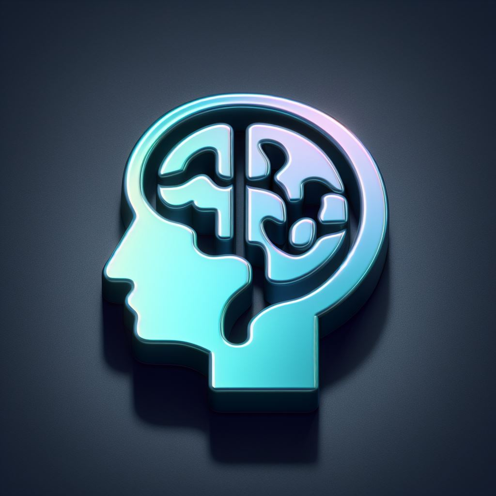

<div id="top"></div>

[![Contributors][contributors-shield]][contributors-url]
[![Forks][forks-shield]][forks-url]
[![Stargazers][stars-shield]][stars-url]
[![Issues][issues-shield]][issues-url]
[![MIT License][license-shield]][license-url]

<br />
<div align="center">
  <a href="https://github.com/brainsaysno/psychat">
    
  </a>

<h1 align="center">PsyChat</h1>

  <p align="center">
    <a href="https://github.com/brainsaysno/psychat"><strong>Explore the docs »</strong></a>
    <br />
    <br />
    <a href="https://psychat.nrusso.dev/">Visit</a>
    ·
    <a href="https://github.com/brainsaysno/psychat/issues/new">Report a bug</a>
    
  </p>
</div>

<details>
  <summary>Content Table</summary>
  <ol>
    <li>
      <a href="#about-the-project">About the Project</a>
      <ul>
        <li><a href="#technologies-used">Technologies Used</a></li>
      </ul>
    </li>
    <li>
      <a href="#build-locally">Construir localmente</a>
      <ul>
        <li><a href="#requirements">Requirements</a></li>
        <li><a href="#installation">Installation</a></li>
      </ul>
    </li>
    <li><a href="#usage">Usage</a></li>
    <li><a href="#contribute">Contribute</a></li>
    <li><a href="#license">License</a></li>
    <li><a href="#contact">Contact</a></li>
  </ol>
</details>

## About the Project

PsyChat is an AI-powered psychology game that let's you interact with people with diverse diagnoses, allowing you to engage in insightful conversations. It offers a unique opportunity to explore mental health scenarios, fostering empathy and understanding. Developed over a weekend.

### Technologies Used


- [Typescript](https://www.typescriptlang.org/)
- [Svelte](https://svelte.dev/)
- [SvelteKit](https://kit.svelte.dev/)
- [OpenAI Node SDK](https://github.com/openai/openai-node)
- [GPT](https://openai.com/gpt-4)
- [faker-js](https://fakerjs.dev/)
- [Tailwind](https://tailwindcss.com/)
- [Pico CSS](https://picocss.com/)
- [Figma](https://figma.com/)

## Build Locally

### Requirements

- pnpm
  ```sh
  npm i -g pnpm
  ```

### Installation

1. Clone the repo
   ```sh
   git clone https://github.com/brainsaysno/psychat.git
   ```
2. Install packages
   ```sh
   cd psychat
   pnpm i
   ```
3. Create a .env file with your OpenAI api key
   ```sh
    echo "OPENAI_API_KEY='YOUR_OPENAI_API_KEY'" > .env
   ```
4. Your ready to use PsyChat. Run locally with
   ```sh
    pnpm run dev
   ```

## Usage

> TODO: add screenshots

## Contribute

Contributions are what make the open-source community so great for learning, getting inspired, and creating. Any contribution you make will be **greatly appreciated**.

1. [_Fork_](https://github.com/brainsaysno/psychat/fork) the project
2. Clone the forked repo to your computer (`git clone https://www.github.com/YOUR-USER/psychat.git`)
3. Create a branch for your proposal (`git checkout -b proposal/PROPOSAL-NAME`)
4. Make changes on the code
5. _Commit_ your changes (`git commit -m 'Add PROPOSAL-NAME'`)
6. _Push_ your branch (`git push -u origin proposal/PROPOSAL-NAME`)
7. Open a new [_Pull Request_](https://github.com/brainsaysno/psychat/compare) explaining your proposal

If you wish to contribute economically with the developers of PsyChat you can do so via [PayPal](https://paypal.me/brainsaysno).

## License

Distributed under MIT license. See [licencia](LICENSE) for more information.

## Contact

Nicolás Russo - [nrusso@nrusso.dev](mailto:nrusso@nrusso.dev)

[ LinkedIn](https://www.linkedin.com/in/nicolas-russo-ortiz/) [ GitHub](https://github.com/brainsaysno)

Project link: [https://github.com/brainsaysno/psychat](https://github.com/brainsaysno/psychat)

[contributors-shield]: https://img.shields.io/github/contributors/brainsaysno/psychat.svg?style=for-the-badge
[contributors-url]: https://github.com/brainsaysno/psychat/graphs/contributors
[forks-shield]: https://img.shields.io/github/forks/brainsaysno/psychat.svg?style=for-the-badge
[forks-url]: https://github.com/brainsaysno/psychat/network/members
[stars-shield]: https://img.shields.io/github/stars/brainsaysno/psychat.svg?style=for-the-badge
[stars-url]: https://github.com/brainsaysno/psychat/stargazers
[issues-shield]: https://img.shields.io/github/issues/brainsaysno/psychat.svg?style=for-the-badge
[issues-url]: https://github.com/brainsaysno/psychat/issues
[license-shield]: https://img.shields.io/github/license/brainsaysno/psychat.svg?style=for-the-badge
[license-url]: https://github.com/brainsaysno/psychat/blob/main/LICENSE
